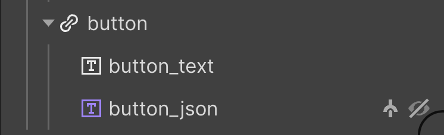

# Copy JSON - Web Bae

A no-code tool to copy Webflow component json to clipboard.

## Installation

### 1. Add script tag to before `</body>`

### 2. Create your HTML: A link block with two div text children, the button text and json data (hide this)

### 3. Add the following attributes

To the link block: `wb-data="copy-button"`\
To the button text div: `wb-data="text"`\
To the hidden json: `wb-data="json"`\

